# Path: screenshots/

## Short Demonstration of the Application

https://mum0-my.sharepoint.com/:v:/g/personal/binod_gurung_miu_edu/EaYnrXxHNChLk_tapNT9dSsBMaB2iWNaijhbGhgvAuNQZA?referrer=Teams.TEAMS-ELECTRON&referrerScenario=MeetingChicletGetLink.view.view

## Login

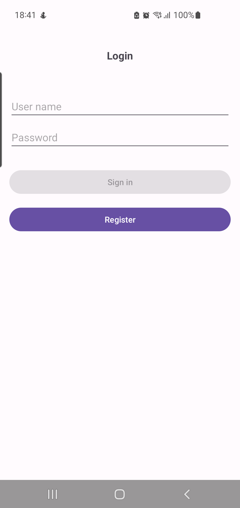
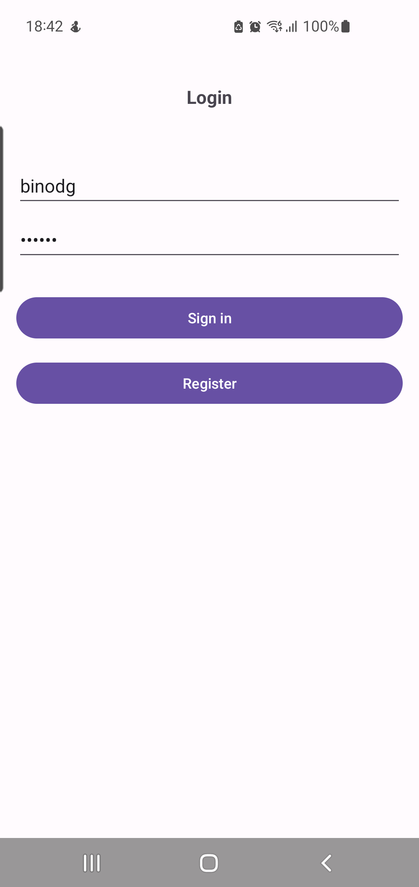

## Register User

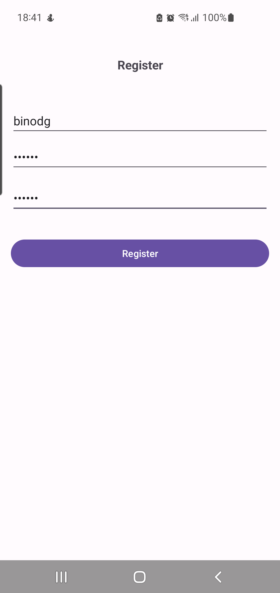

## Recipe Home Screen

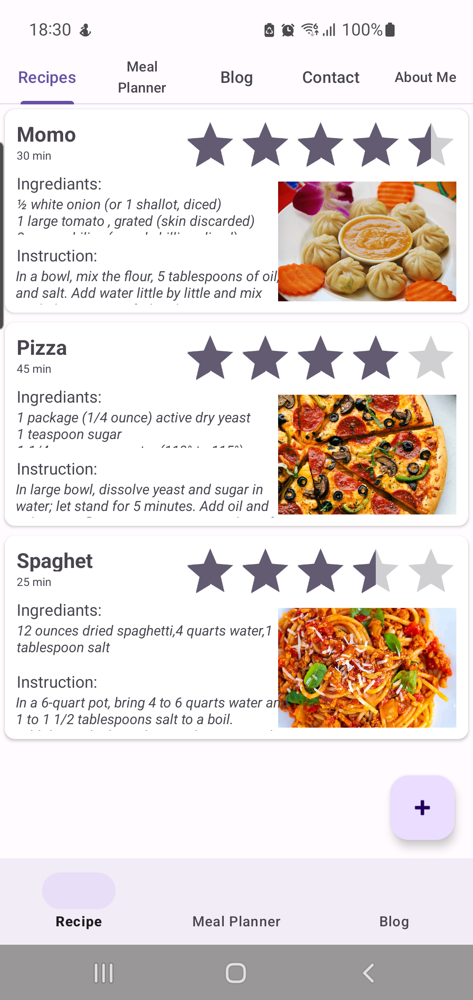

## Recipe Add

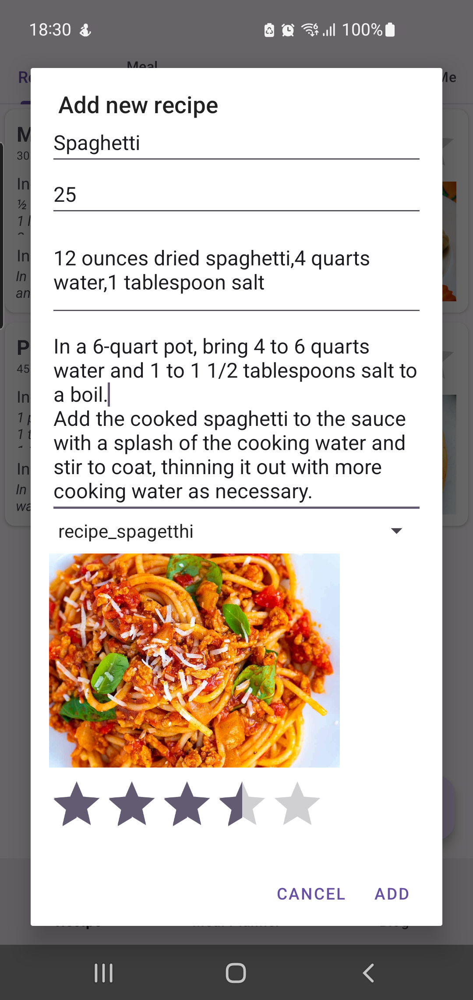

## Meal Plan

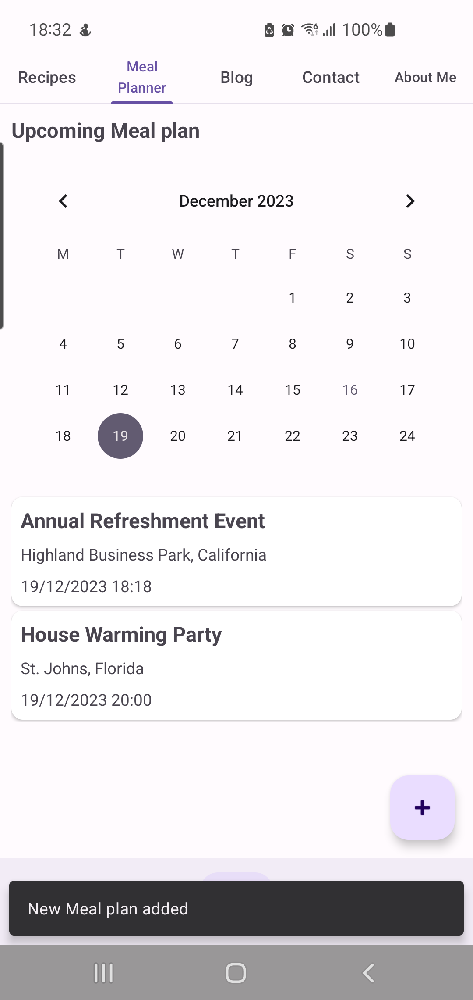

## Meal Plan add

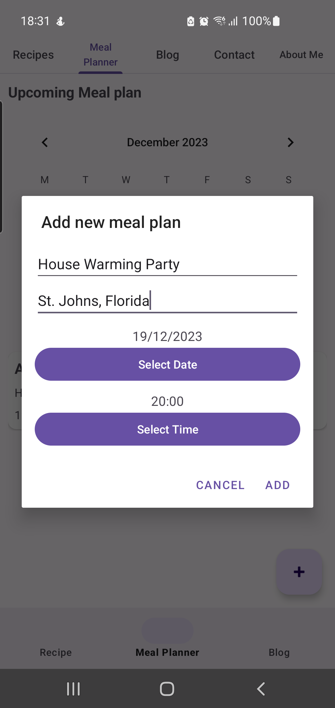

## Blog Posts

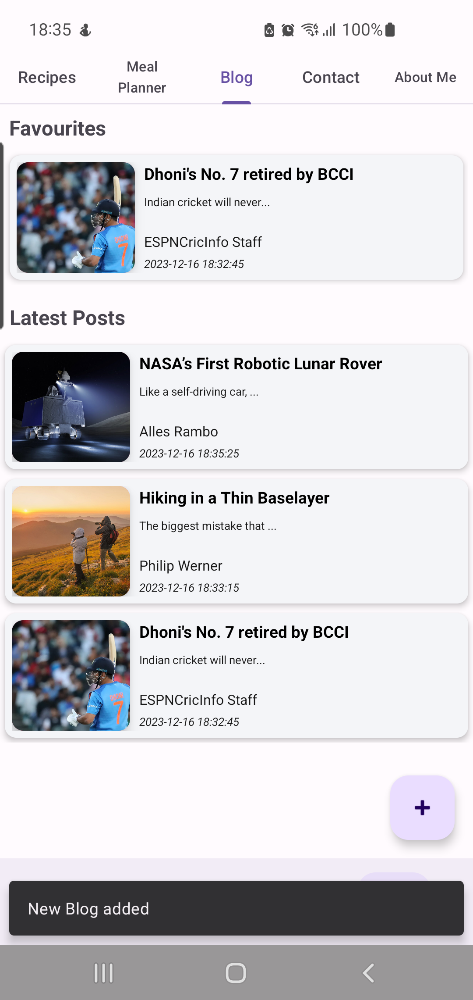

## Blog Posts Add

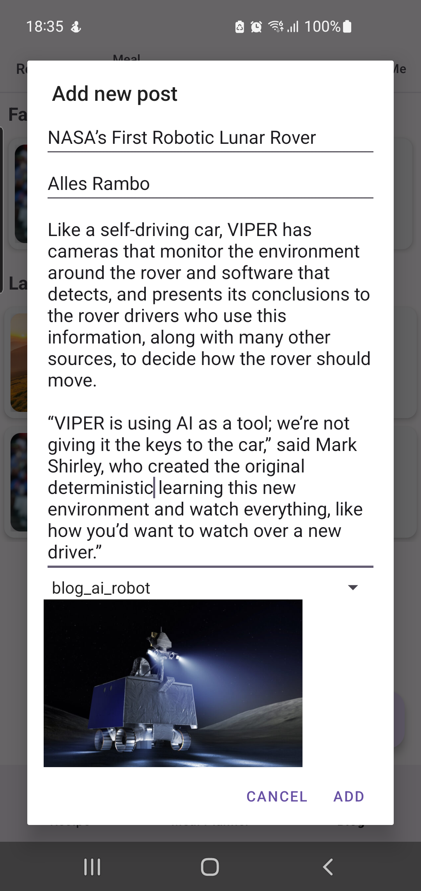

## Blog Detail Add

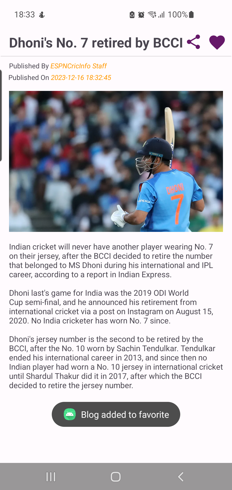

## Blog Detail Share

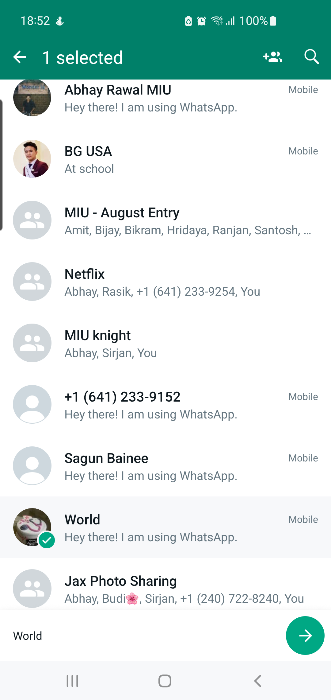
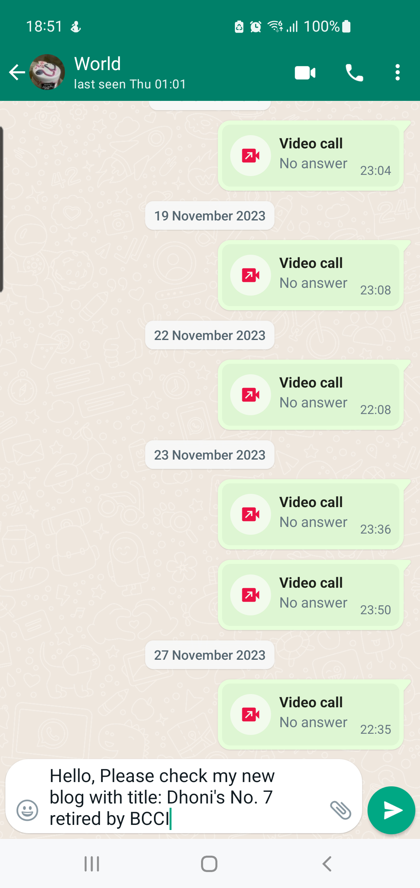

## Contact Phone

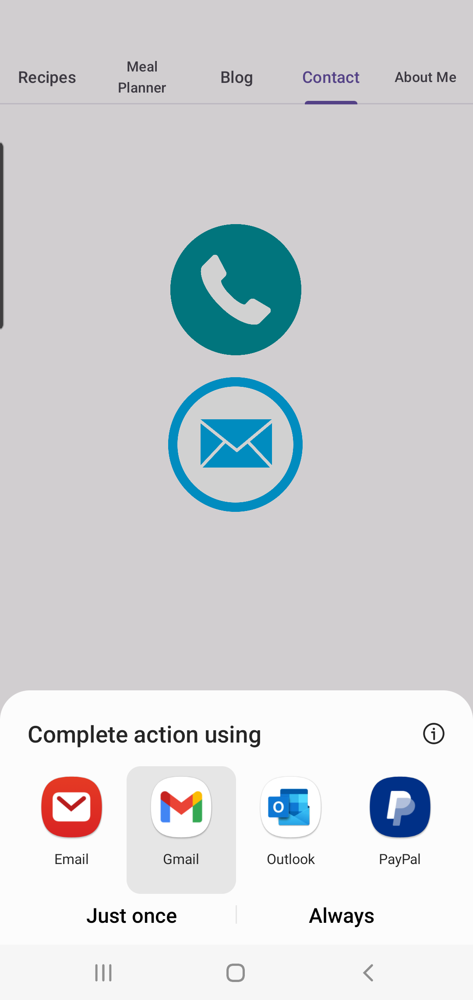

## Send Email Dialog

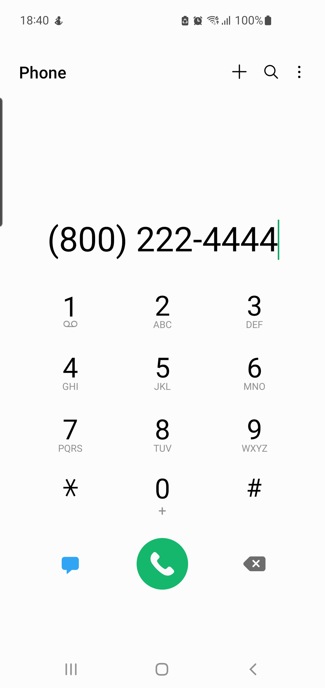

## Send Email

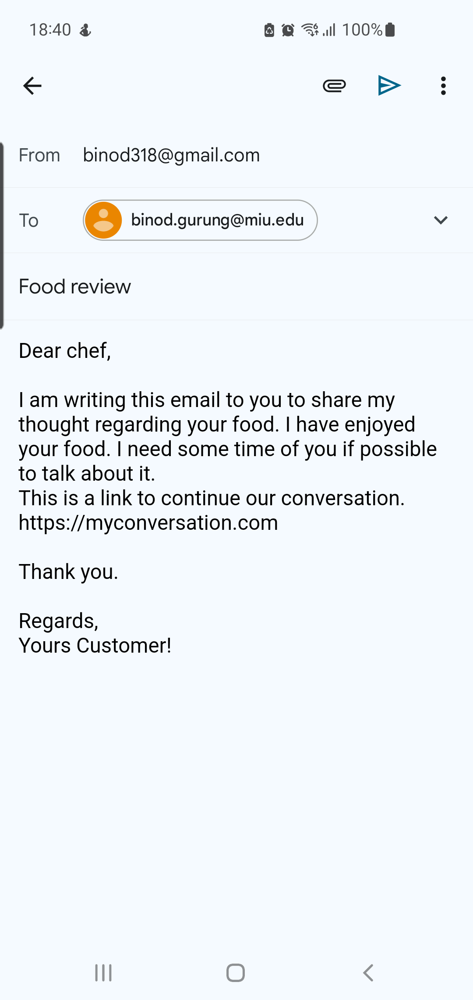

## About Me

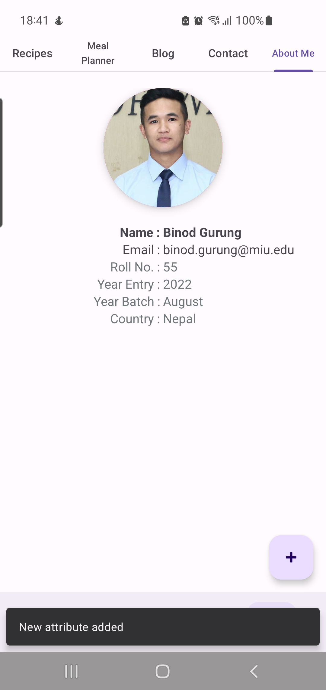

## About Me Add

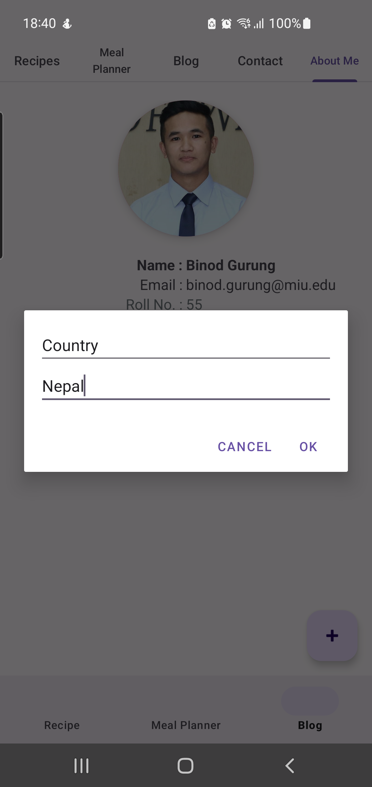