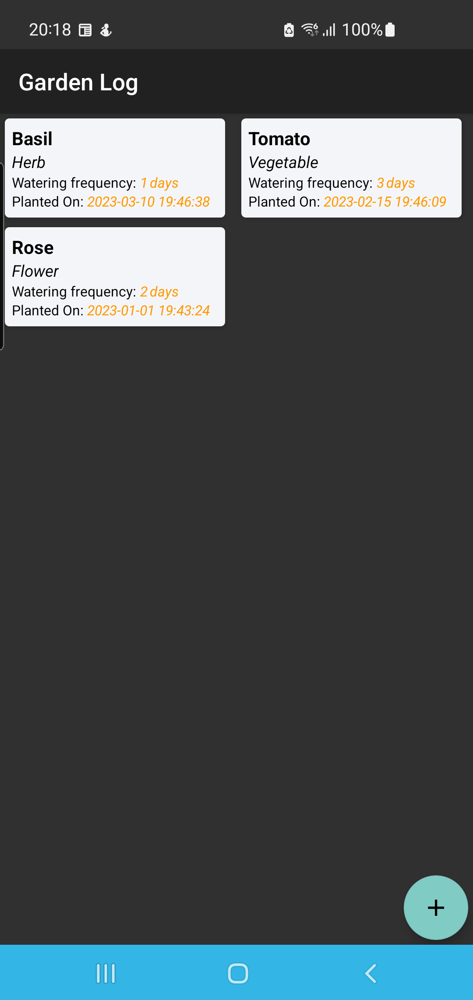
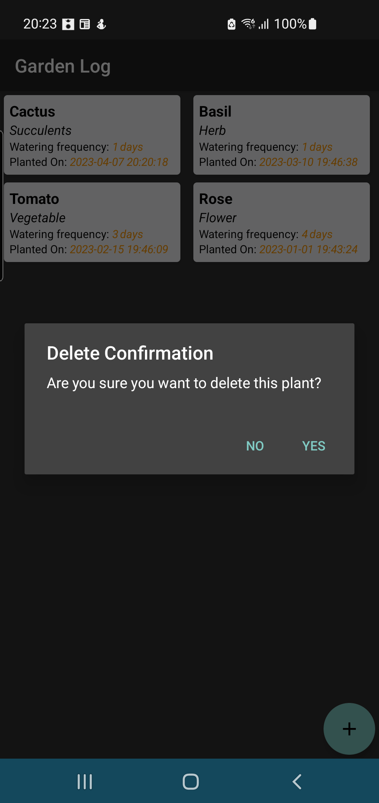
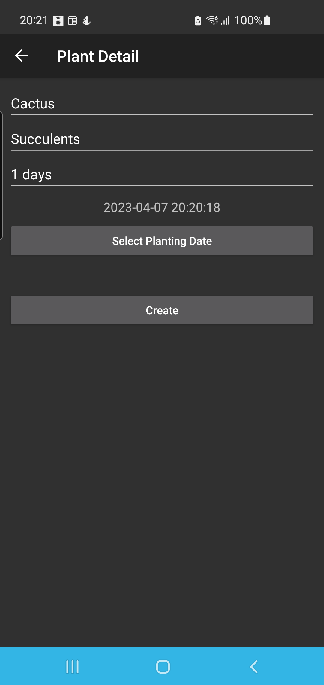
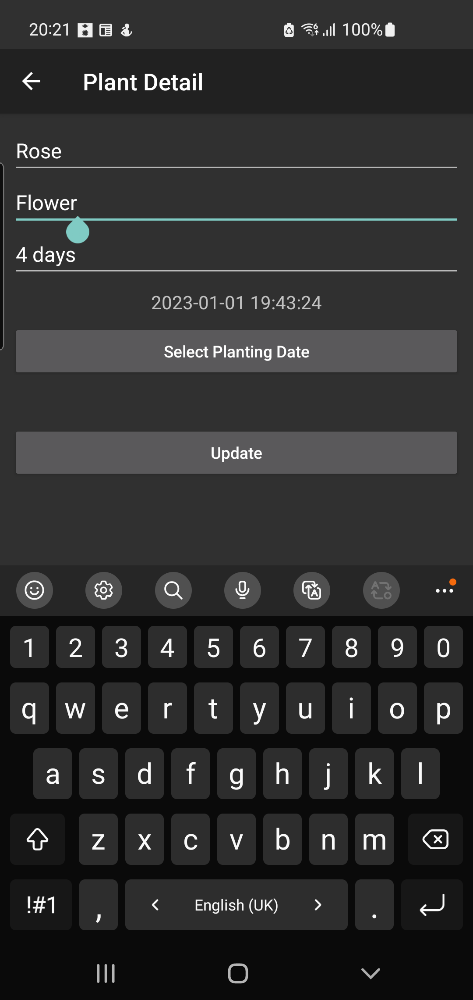

# Documentation

This is the Gardening Journal App. This is developed to keep track of all the plants planted in the garden. This gices the plant name, what type is it, what is the watering frequency needed for this plant and when was it planed. The Garden Log screen displays all the plants in the grid view. Long pressing the plant tile gives us option to delete the plant. lant Detail screen allows us to add new plant, update the plant. 

This app uses Room databse to store all the data. The room version is 2.6.1. All the database operations are asynchronus that uses coroutines which assures the main thread is not blocked.

This app uses navigation fragment component of version 2.7.6 to create a navigation structure between screens.

This app uses ViewModel and LiveData so that any changes in the data is reflected to UI automatically.

Target API Level is 33, compile sdk API Level is 34 and Minimum API Level to run this app is API level 26.

# Path: screenshots/

## Garden Log

## Plant Detail

