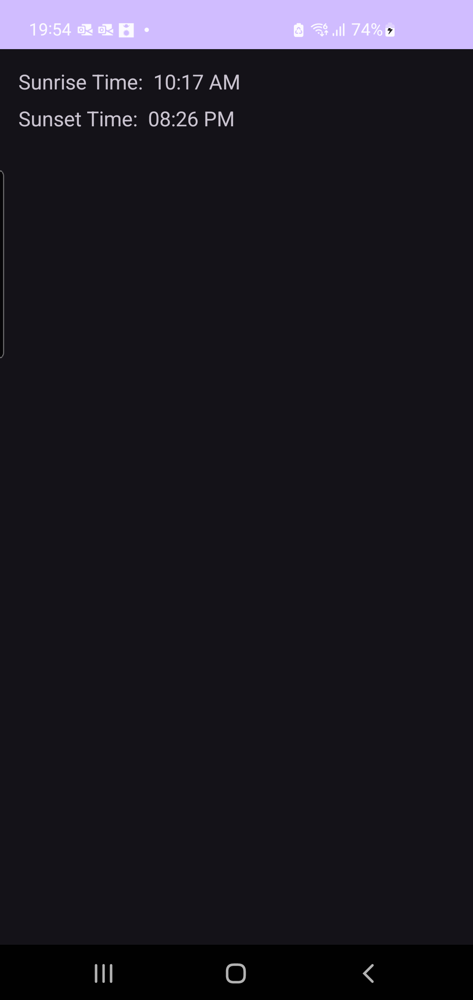
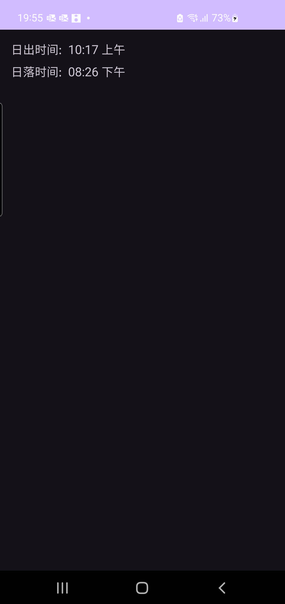

# Documentation

This is the app to demonstrate the localization based on the language chosen in the Settings. This app is localized to two languages - English and Chinese.

# Path: screenshots/

## English

## Chinese

